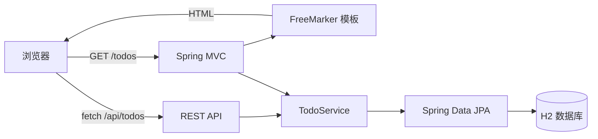

# 架构说明（K-beat）

本项目选择“服务端渲染为主 + 渐进增强”为默认路径：

- 无 JS：页面依然可用（表单提交 + 服务端渲染 + Redirect + Toast 回显）
- 有 JS：自动升级为无刷新交互（调用 `/api/todos`），并在本地做乐观 UI 与小型交互反馈

## 组件关系



## 目录结构

```text
src/
  main/
    java/com/example/todo/
      controller/        MVC 控制器 + API 控制器 + 异常处理
      service/           业务逻辑（校验、排序、状态切换）
      repository/        JPA Repository
      model/             JPA Entity / Enum
      config/            启动期初始化（如 data 目录准备）
      observability/     请求ID/安全响应头/Server-Timing 等横切能力
    resources/
      templates/         FreeMarker 页面（index/error）
        partials/        原子设计：页面级 layout/partials（head/topbar/foot）
      static/assets/     CSS/JS（缓存版本号通过 app.assets.version 控制）       
  test/
    java/...             Controller/API 测试
    resources/           测试环境配置（H2 内存库）
```

## 数据与排序策略

默认排序策略（`TodoService.DEFAULT_SORT`）：

1. 进行中优先（未完成在前）
2. 到期更早的优先
3. 优先级更高的优先
4. 最后按创建时间进行稳定排序

这保证列表对“下一步该做什么”更友好。

## 渐进增强策略（无回退冲突）

页面层（`index.ftl`）遵循以下原则：

- 任何关键操作都有 **纯表单** 路径（POST + redirect）
- JS 只是在 `fetch` 可用时“拦截并升级体验”，失败则回到表单提交
- UI 不渲染原始 JSON；API 错误转换为友好 toast 文案

## 可观测性（Observability）与性能

- 关联 ID：所有响应均返回 `X-Request-Id`，API 错误体包含 `request_id`，错误页展示 `requestId` 便于排查
- `Server-Timing`：响应头提供简易耗时信息，方便快速定位慢请求
- Actuator：提供健康检查与指标（生产环境建议走内网或加鉴权）

